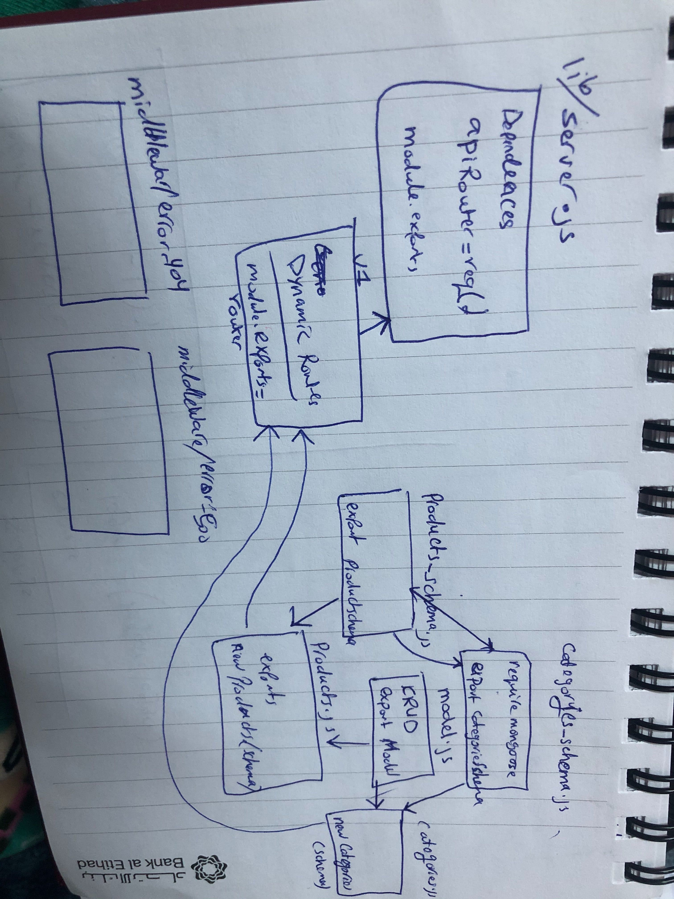

# lab09-api-server

## API SERVER

### Author: MUNA

### Links and Resources

- [submission PR](https://github.com/401-advanced-javascript-muna/lab09-api-server/pull/1)
- [ci/cd](https://github.com/401-advanced-javascript-muna/lab09-api-server/actions) (GitHub Actions)

### Setup

#### `.env` requirements (where applicable)
MONGOOSE_URI=mongodb://localhost:27017/storedb
PORT=3000

#### How to initialize/run your application (where applicable)

- e.g. `npm start`

#### Tests

- How do you run tests? 
 `npm test`
- Any tests of note? 
- Describe any tests that you did not complete, skipped, etc

#### UML

